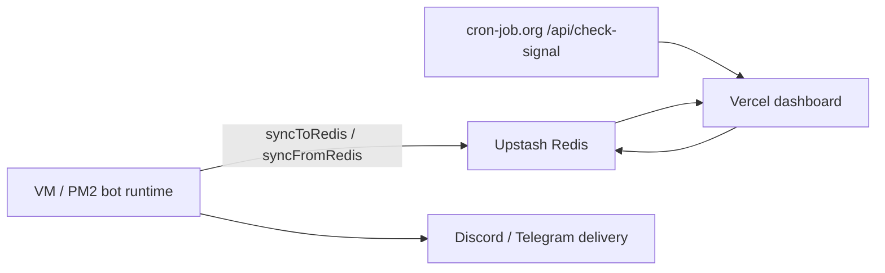

# Crypto Signal Bot

Crypto signal scanner berbasis **Node.js/JavaScript** dengan core strategy lama tetap dipertahankan. Repo ini sekarang punya jalur serverless untuk satu kali scan per request, cocok dipanggil cron eksternal seperti `cron-job.org`, plus **Discord slash commands** serverless untuk kontrol dan status, dan delivery signal/info yang bisa dikirim ke Telegram + Discord.

## Deteksi Tech Stack

- Runtime utama: **Node.js / JavaScript**
- Web layer: **Express** di root `server.js`
- Dashboard: **Next.js App Router** di `dashboard/`
- Package manager: **npm**
- Entry point legacy: `server.js`
- Entry point CLI one-shot: `src/run_once.js`
- Entry point serverless: `dashboard/src/app/api/check-signal/route.ts`
- Discord interaction endpoint: `dashboard/src/app/api/discord/route.ts`
- Scheduler lama GitHub Actions: `.github/workflows/cron.yml` sudah dihapus
- Strategy: `src/modules/strategy/index.js`
- Signal generator / orchestrator: `src/modules/scanner/index.js`
- Delivery layer: `src/services/signal_delivery.js`
- Telegram notifier: `src/modules/telegram/index.js`
- Discord notifier: `src/utils/discord.js`

## Arsitektur Baru

### Lama

- GitHub Actions menjalankan scanner tiap jam.
- Root app bisa hidup lama di VM untuk Telegram polling + scanner.
- Signal dan status bisa dikirim ke Telegram + Discord dari proses background yang selalu aktif.

### Baru

- `cron-job.org` memanggil endpoint `GET /api/check-signal` setiap 1 jam.
- Endpoint menjalankan scan **sekali saja** lalu selesai dalam satu HTTP request.
- Redis Upstash dipakai untuk dedupe signal baru.
- Signal/info dikirim via **Telegram bot + Discord Webhook**.
- Discord slash commands jalan via `POST /api/discord`.

### Alur

1. Cron hit `/api/check-signal`
2. Endpoint validasi `CRON_SECRET`
3. Config existing diload
4. Scanner jalan sekali
5. Signal yang lolos dicek ke Upstash Redis
6. Kalau signal belum pernah dikirim untuk candle itu, alert dikirim ke Telegram dan Discord
7. JSON status dikembalikan ke caller

### Redis Sebagai Shared State

Redis dipakai sebagai jembatan state supaya VM bot dan Vercel dashboard baca sumber yang sama.



Urutan praktisnya:

1. VM scan jalan dan push state ke Redis
2. Vercel dashboard baca Redis dulu, file lokal jadi fallback
3. `check-signal` di Vercel pakai `runSignalCheck()` yang ikut sync Redis
4. Kalau Redis mati, app tetap jalan, tapi dashboard bisa balik ke state lokal atau kosong

## File Penting

- `dashboard/src/app/api/check-signal/route.ts` - serverless endpoint
- `dashboard/src/app/api/discord/route.ts` - Discord interaction endpoint
- `src/services/run_signal_check.js` - wrapper one-shot reusable
- `src/services/signal_delivery.js` - fanout notifier Telegram + Discord
- `src/services/discord_commands.js` - shared slash command definitions/handlers
- `src/modules/scanner/index.js` - core scan logic
- `src/modules/strategy/index.js` - strategy existing
- `src/utils/discord.js` - Discord webhook formatter/sender
- `src/utils/signal_dedupe.js` - Upstash dedupe helper

## Environment Variables

### Wajib untuk endpoint

| Variable | Kegunaan |
|---|---|
| `CRON_SECRET` | Secret untuk validasi request cron |
| `CHECK_SIGNAL_URL` | URL endpoint check-signal yang dipanggil `/scan-now` |
| `SCAN_TRIGGER_TIMEOUT_MS` | Timeout request trigger dari slash command |
| `TELEGRAM_BOT_TOKEN` | Token bot Telegram untuk delivery dan command polling |
| `TELEGRAM_CHAT_ID` | Chat/channel tujuan Telegram |
| `DISCORD_WEBHOOK_URL` | Webhook Discord utama |
| `UPSTASH_REDIS_REST_URL` | URL REST Upstash Redis |
| `UPSTASH_REDIS_REST_TOKEN` | Token Upstash Redis |
| `OPENROUTER_API_KEY` | AI validator / refinement |
| `DISCORD_PUBLIC_KEY` | Public key Discord app untuk verifikasi interaction |
| `DISCORD_APPLICATION_PUBLIC_KEY` | Alias opsional kalau lo pakai nama env ini |
| `DISCORD_APPLICATION_ID` | Application ID Discord untuk register command |
| `DISCORD_BOT_TOKEN` | Bot token untuk register slash command |
| `DISCORD_GUILD_ID` | Opsional, buat register command cepat ke guild test |

### Existing env yang tetap dipakai

| Variable | Kegunaan |
|---|---|
| `OPENROUTER_MODEL` | Model OpenRouter |
| `BYBIT_API_KEY` / `BYBIT_API_SECRET` | Private balance/trade data bila dipakai |
| `BYBIT_BASE_URLS` / `BYBIT_BASE_URL` | Fallback Bybit |
| `FUTURES_DATA_PROVIDER_ORDER` | Urutan provider market data futures |
| `FUTURES_DATA_ENABLE_HYPERLIQUID` | Toggle provider |
| `FUTURES_DATA_ENABLE_BINANCE_FALLBACK` | Fallback Binance futures |
| `ACCOUNT_BALANCE` | Basis risk existing |
| `MIN_RR_RATIO` | Minimum risk/reward existing |
| `MAX_PAIRS` | Batas pair scan existing |
| `SCAN_INTERVAL_MS` | Tetap ada sebagai config, tapi tidak dipakai untuk scheduler serverless |
| `LOG_LEVEL` | Level log |

### Runtime VM

| Variable | Kegunaan |
|---|---|
| `DISABLE_BACKGROUND_RUNTIME=1` | Mematikan scanner + Telegram polling kalau mau mode one-shot saja |
| `ENABLE_LEGACY_SCANNER=0` | Alias kompatibilitas untuk mematikan background runtime |

## Discord Slash Commands

Command yang tersedia:

- `/status` - bot health, scan status, dan runtime info
- `/scan-now` - trigger scan sekali, hasilnya dikirim ke channel lewat webhook
- `/scan-now` - kirim request ke `CHECK_SIGNAL_URL` dengan `CRON_SECRET`
- `/active` - list active trades
- `/watchlist` - latest watchlist
- `/performance` - cached performance summary
- `/last-signal` - signal terakhir
- `/health` - environment/service health
- `/help` - daftar command

Catatan:

- `/scan-now` itu fire-and-forget. Command ini memicu scan baru, tapi hasil final tetap dikirim lewat alert webhook, bukan balasan command yang lama.
- `/performance` pakai cached snapshot yang sudah tersimpan di Redis, jadi aman buat serverless dan cepat.

## Install

```bash
npm install
```

## Jalankan Lokal

### Persistent VM runtime

```bash
npm start
```

Default sekarang root app menjalankan dashboard HTTP + Telegram polling + scanner dalam mode persistent. Set `DISABLE_BACKGROUND_RUNTIME=1` kalau mau hanya HTTP one-shot / serverless.

### One-shot manual

```bash
node src/run_once.js
```

## Deploy ke Vercel

Repo ini paling cocok dipisah per target:

1. **Dashboard Next.js**: deploy folder `dashboard/` sebagai project Vercel terpisah dan expose `app/api/check-signal/route.ts` serta `app/api/discord/route.ts`
2. **Root Node app**: dipakai untuk runtime VM persistent kalau lo mau Telegram polling + scanner jalan terus

Langkah endpoint:

1. Import repo ke Vercel
2. Set env vars di atas
3. Pastikan `CRON_SECRET`, Redis, OpenRouter, Telegram, Discord webhook, `DISCORD_PUBLIC_KEY`, dan `DISCORD_APPLICATION_ID` terisi
4. Deploy
5. Di Discord Developer Portal, set **Interactions Endpoint URL** ke:
   - `https://<dashboard-vercel-domain>/api/discord`
6. Register slash commands:
   - pakai guild dulu untuk testing cepat:
     ```bash
     cd dashboard
     DISCORD_APPLICATION_ID=... DISCORD_BOT_TOKEN=... DISCORD_GUILD_ID=... npm run discord:register
     ```
   - kalau sudah final, hapus `DISCORD_GUILD_ID` supaya register global

Kalau hanya butuh endpoint cron, deploy `dashboard/` sudah cukup.

## Auto Deploy VM via GitHub Actions

Kalau root VM lo jalan via PM2, repo ini juga bisa auto update tiap push ke `main`.

### Secrets GitHub yang dibutuhkan

- `SSH_HOST`
- `SSH_USER`
- `SSH_PRIVATE_KEY`
- `SSH_PORT` - opsional, default `22`
- `SSH_FINGERPRINT` - opsional tapi disarankan

### Cara kerja

- GitHub Actions trigger saat ada push ke `main`
- Actions SSH ke VM
- VM menjalankan `deploy.sh`
- `deploy.sh` melakukan `git pull --ff-only` lalu `pm2 restart crypto-bot --update-env`

### Catatan

- Path default VM yang dipakai workflow ini: `/root/crypto-signal-bot`
- Kalau path repo di VM beda, ubah `cd /root/crypto-signal-bot` di workflow atau set `REPO_DIR` saat memanggil script
- Pastikan working tree VM bersih, karena `deploy.sh` akan menolak pull kalau ada perubahan lokal yang belum di-commit

## Setup cron-job.org

1. Buat job baru di cron-job.org
2. URL:
   - `https://<dashboard-vercel-domain>/api/check-signal`
3. Method:
   - `GET`
4. Header:
   - `Authorization: Bearer <CRON_SECRET>`
5. Schedule:
   - `5 * * * *`

## Setup /scan-now

`/scan-now` tidak menjalankan scanner langsung di interaction handler. Command ini hanya menembak endpoint check-signal yang sama dengan cron, lalu balas cepat bahwa request sudah masuk antrian.

Set ini di Vercel project `dashboard/`:

- `CRON_SECRET` - cukup satu kali, dipakai oleh cron-job.org dan `/scan-now`
- `CHECK_SIGNAL_URL` - URL public endpoint scan, contoh:
  - `https://crypto-signal-bot-blush.vercel.app/api/check-signal`
- `SCAN_TRIGGER_TIMEOUT_MS` - batas tunggu trigger Discord sebelum request dibatalkan, default `60000`

Kalau `CHECK_SIGNAL_URL` tidak diisi, command akan coba pakai `VERCEL_PROJECT_PRODUCTION_URL` atau `VERCEL_URL`.

Kenapa `5 * * * *`:

- Candle 1H sudah close dulu sebelum dicek
- Mengurangi risiko baca candle yang belum final

## Contoh Request Manual

```bash
curl -X GET "https://<domain>/api/check-signal" \
  -H "Authorization: Bearer $CRON_SECRET"
```

Atau pakai query param:

```bash
curl "https://<domain>/api/check-signal?secret=$CRON_SECRET"
```

## Contoh Response

```json
{
  "ok": true,
  "status": "SIGNALS_SENT",
  "signalCount": 1,
  "durationMs": 12345,
  "report": {
    "status": "SIGNALS_SENT"
  }
}
```

## Test Manual

1. Request tanpa secret harus `401`
2. Request dengan secret valid dan tanpa signal harus tetap `200` dengan JSON valid
3. Kalau signal baru muncul, Telegram dan Discord masing-masing harus menerima 1 pesan
4. Request ulang untuk candle yang sama harus kena dedupe Redis
5. Untuk test slash command, kirim `/status` atau `/help` di Discord setelah command registration berhasil

## Catatan Arsitektur

- Trading strategy, indikator, TP/SL, risk management, pair/watchlist, dan format signal existing tidak diubah kecuali kebutuhan transport.
- Dedupe key:
  - `signal:{symbol}:{timeframe}:{side}:{candleTime}`
- TTL dedupe:
  - 7 hari
- Telegram polling + scanner sekarang jalan di VM persistent kalau background runtime aktif.
- Discord sekarang menggunakan webhook, bukan bot process yang harus online 24/7.
- Discord slash commands jalan lewat endpoint serverless, bukan Discord Gateway.
- Discord channel juga bisa menerima scan summary penting, daily summary 1x sehari, health ping saat scan kosong, dan alert fallback provider bila data source lagi bermasalah.
