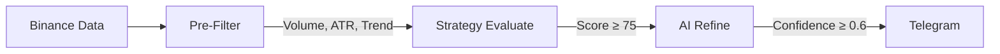
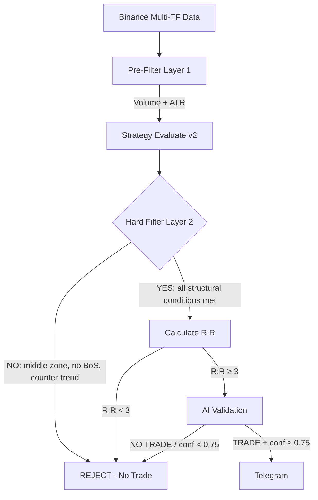

# 🔍 Signal Bot Analysis & Improvement Plan

## Current Architecture Flow

## 🚨 Problems Identified

### 1. **No Trend Strength Classification** (CRITICAL)
The current `analyzeTrend()` only returns `bullish/bearish/neutral` + a raw strength number. There's **no concept of "strong bullish"** or "moderate bearish". Your proposed prompt asks for `weak/moderate/strong` but the code never classifies this.

**Impact**: The AI receives raw data and has to guess what "strong" means → inconsistent filtering.

### 2. **No Break of Structure (BoS) Detection** (CRITICAL)
Your proposed prompt asks for `bos_m15: true/false` but the code **never detects break of structure**. Currently M15 only runs the same EMA trend analysis as D1. A BoS is a very specific market structure concept (price breaking a previous swing high/low), not just an EMA crossover.

**Impact**: Without BoS, you're entering on weak M15 confirmations → bad entries.

### 3. **No Price Position Classification** (CRITICAL)
Your prompt asks for `price_position_h4: near_support/near_resistance/middle`, but the strategy only checks `distToSupport < 2%`. There's no concept of "middle zone" = danger zone. Currently, a coin at 1.9% from support still passes, even if it's also 1.9% from resistance (= middle).

**Impact**: You enter trades in the middle of ranges → no edge.

### 4. **AI Prompt is Too Permissive** (HIGH)
The current AI system prompt says: *"Format the provided technical analysis into structured JSON signals."* It tells the AI to **format**, not to **filter**. The AI is *never told it's allowed to say NO*. It will always try to give you an entry because that's what it was asked to do.

**Impact**: The AI rubber-stamps bad signals instead of filtering them.

### 5. **No R:R Validation Before AI** (HIGH)
R:R ratio is only calculated **after** the AI responds (in Telegram formatting). The AI might give a 1:1 R:R and it would still get sent to Telegram (as long as confidence ≥ 0.6).

**Impact**: Bad R:R signals getting through.

### 6. **Score System is Too Simple** (MEDIUM)
4 conditions × 25 points each. Minimum 75 = 3/4 must be true. But not all conditions are equal — D1 trend alignment should weigh more than stochastic confirmation.

**Impact**: A signal with stoch + M15 + support but **no D1 trend** (75 points) passes = counter-trend trade.

### 7. **Confidence Threshold Too Low** (MEDIUM)
`confidence >= 0.6` is too permissive. The AI will often give 0.65-0.7 to mediocre setups.

**Impact**: Marginal signals pass through.

---

## ✅ Proposed Solution Architecture

### Key Changes:

| Area | Before | After |
|------|--------|-------|
| Trend Strength | Raw 0-1 number | `weak/moderate/strong` classification |
| M15 Analysis | EMA crossover only | BoS detection + structure analysis |
| Price Position | `dist < 2%` only | `near_support/near_resistance/middle` |
| Strategy Score | Equal weight (25 each) | Weighted: D1=30, Position=30, BoS=25, Stoch=15 |
| Hard Filters | None | 6 kill-switches before AI |
| R:R Check | After AI (in Telegram) | Before AI (programmatic) |
| AI Role | "Format data" | "You are a FILTER, say NO TRADE" |
| Confidence Min | 0.60 | 0.75 |
| AI Output | Always gives entry | Can return `NO TRADE` |

---

## Implementation Plan

### Step 1: Enhance Trend Analysis
Add `classifyStrength()` to categorize `weak/moderate/strong` with clear thresholds.

### Step 2: Add Break of Structure Detection  
New function in indicators: detect when M15 price breaks a previous swing high (bullish BoS) or swing low (bearish BoS).

### Step 3: Add Price Position Classification
Classify current price as `near_support`, `near_resistance`, or `middle` based on relative distances.

### Step 4: Rebuild Strategy with Hard Filters
Add weighted scoring + mandatory conditions (D1 trend alignment is required, not optional).

### Step 5: Pre-AI R:R Validation
Calculate SL/TP programmatically before sending to AI. Reject if R:R < 3.

### Step 6: Rewrite AI Prompt
Your proposed prompt is excellent as a starting point. I'll integrate it with the actual data the code produces.

### Step 7: Post-AI Validation
Validate AI response: R:R check, confidence threshold bump to 0.75.
